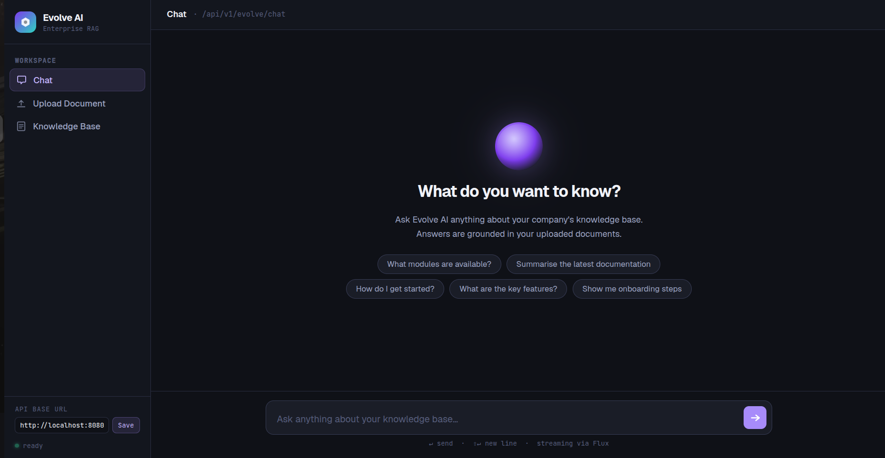
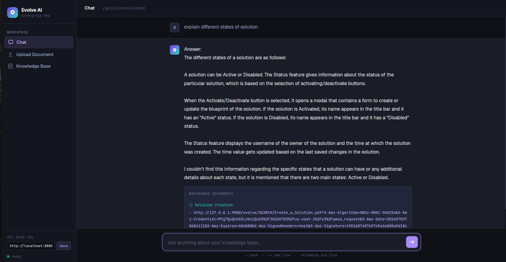

<div align="center">



# 🧠 Evolve AI
### Enterprise Document Intelligence Platform

**Ask natural language questions over your company's internal documents — and get accurate, document-grounded streaming answers in real time.**


</div>

---

## 🎬 Demo

| Chat Interface | Streamed Response with Source References |
|---|---|
|  |  |

> 📹 **[Watch Full Demo Video](assets/demo.mp4)** — Upload a document, watch it embed asynchronously, then ask questions and see live streamed answers with source citations.

---

## 💡 What Is Evolve AI?

Evolve AI is a **production-grade, event-driven RAG (Retrieval-Augmented Generation) platform** built for enterprise use. It plugs into your company's document ecosystem — upload PDFs tagged to business modules, and your team can instantly ask natural language questions and get accurate answers grounded in your actual documentation.

**The key differentiator:** unlike typical RAG chatbots that load documents at startup, Evolve AI is built around a fully **asynchronous, Kafka-driven document pipeline** with a **dual-model AI architecture** — one model generates answers, another acts as a confidence-based quality gate before any response is returned.

---

## ✨ Key Features

| Feature | Description |
|---|---|
| 📤 **Dynamic Document Upload** | Upload PDFs at runtime via REST API, tagged to any business module |
| ⚡ **Async Kafka Pipeline** | Document upload returns `202 Accepted` instantly; embedding happens in the background |
| 🛡️ **AI Evaluation Gate** | `qwen2.5:1.5b` evaluates context relevance before `llama3.2` generates a response |
| 🧠 **Conversational Memory** | `MessageWindowChatMemory` maintains a 20-message sliding window per session |
| 🔍 **Semantic Search** | pgvector cosine similarity (topK=3, threshold=0.75) for high-precision retrieval |
| 📎 **Source References** | Every answer includes the source module name and a presigned MinIO document URL |
| 🗄️ **Document Lifecycle Tracking** | Full status tracking: `PENDING → PROCESSING → COMPLETED / FAILED` with error capture |
| 🖥️ **Built-in UI** | Standalone `evolve-ai-ui.html` for zero-setup testing |

---

## 🏗️ Architecture

```
┌─────────────────────────────────────────────────────────────┐
│                        REST API Layer                        │
│                  GET /chat  POST /upload  GET /documents      │
└──────────────────────┬────────────┬────────────────────────┘
                       │            │
         ┌─────────────▼──┐   ┌─────▼──────────────────────┐
         │  ChatService   │   │   DocumentUploadService     │
         │                │   │                             │
         │ 1. Vector      │   │ 1. Store PDF → MinIO        │
         │    Search      │   │ 2. Save record (PENDING)    │
         │    (topK=3,    │   │ 3. Publish → Kafka          │
         │    0.75 sim)   │   │ 4. Return 202 immediately   │
         │                │   └──────────┬──────────────────┘
         │ 2. Evaluate    │              │
         │    (qwen2.5)   │   ┌──────────▼──────────────────┐
         │                │   │  DocumentEmbeddingListener  │  ← Kafka Consumer
         │ 3. Generate    │   │                             │
         │    (llama3.2   │   │ 1. Download PDF from MinIO  │
         │    + Memory)   │   │ 2. PagePdfDocumentReader    │
         │                │   │ 3. TokenTextSplitter        │
         │ 4. Append      │   │ 4. Embed → pgvector         │
         │    References  │   │    (batch size: 20)         │
         └───────┬────────┘   │ 5. Update status →          │
                 │            │    COMPLETED / FAILED       │
         ┌───────▼────────┐   └─────────────────────────────┘
         │  Flux<String>  │
         │  SSE Streaming │
         └────────────────┘
```

---

## 🛠️ Tech Stack

| Layer | Technology | Purpose |
|---|---|---|
| Framework | Spring Boot 4.1.0 | Application foundation |
| AI Orchestration | Spring AI 2.0.0 | RAG pipeline, chat clients, vector store |
| Answer LLM | Ollama — `llama3.2` | Primary response generation (temp: 0.3, ctx: 2048) |
| Evaluation LLM | Ollama — `qwen2.5:1.5b` | Context relevance gate (auto-unloads via `@PreDestroy`) |
| Embeddings | Ollama — `nomic-embed-text` | 768-dim document & query embeddings |
| Vector Store | pgvector + HNSW index | Cosine similarity search over document chunks |
| Object Storage | MinIO 8.5.13 | PDF storage with presigned URL generation |
| Messaging | Apache Kafka | Async document ingestion decoupling |
| Chat Memory | `MessageWindowChatMemory` | 20-message in-memory conversation window |
| Document Parsing | `PagePdfDocumentReader` + `TokenTextSplitter` | PDF extraction and chunking |
| ORM | Spring Data JPA + Hibernate | Document lifecycle tracking |
| Build | Maven + Java 21 | Build toolchain |

---

## 🧩 How It Works — Deep Dive

### 📤 Document Upload Flow

```
POST /upload (file + moduleName)
    │
    ├── 1. Store PDF bytes → MinIO (SEARCH/{filename})
    ├── 2. Generate presigned URL for future retrieval
    ├── 3. Persist EvolveDocument record (status: PENDING)
    ├── 4. Publish DocumentUploadRequest → Kafka (vector_upload topic)
    └── 5. Return HTTP 202 Accepted ← instant response to caller
```

### ⚡ Async Embedding Pipeline (Kafka Consumer)

```
Kafka Consumer (vector_upload topic, MANUAL_IMMEDIATE ack)
    │
    ├── 1. Update status → PROCESSING
    ├── 2. Download PDF from MinIO as InputStream
    ├── 3. Parse pages with PagePdfDocumentReader (1 page/doc)
    ├── 4. Chunk with TokenTextSplitter
    ├── 5. Attach metadata: { moduleName, documentUrl }
    ├── 6. Batch insert embeddings → pgvector (batch: 20 chunks)
    │        └── Logs JVM memory at each stage for observability
    ├── 7. Update status → COMPLETED
    └── On failure → FAILED + errorMessage captured
```

### 💬 Chat & RAG Flow

```
GET /chat?message=...
    │
    ├── 1. Cosine similarity search (topK=3, threshold=0.75)
    │        └── Returns [] → "I couldn't find enough relevant information."
    │
    ├── 2. EvaluationService (qwen2.5:1.5b)
    │        └── JSON response: { shouldAnswer, confidence, reason }
    │        └── confidence < 0.5 → fallback message
    │
    ├── 3. llamaChatClient.prompt(SYSTEM_PROMPT + docs + question)
    │        └── MessageChatMemoryAdvisor (20-msg window, conversationId: user-123)
    │        └── numPredict: 400, numCtx: 2048, keepAlive: 30m
    │
    └── 4. Flux.concat(streamedAnswer, referenceSection)
             └── Reference: Module name + presigned MinIO URL
```

### 🛡️ Dual-Model Design

The **two-LLM architecture** is what separates this from a basic RAG implementation:

```
User Question
      │
      ▼
┌─────────────────────┐     confidence < 0.5    ┌──────────────────────┐
│   qwen2.5:1.5b      │ ──────────────────────► │  Fallback Response   │
│  (Evaluation Gate)  │                          └──────────────────────┘
│                     │     confidence ≥ 0.5
│  Judges whether     │ ──────────────────────► llama3.2 generates answer
│  retrieved context  │
│  is sufficient      │
└─────────────────────┘
```

`qwen2.5:1.5b` is deliberately kept lightweight — it only decides *whether* to answer, never *what* to answer. This prevents hallucinations when retrieved documents don't adequately cover the question. It's configured with `keepAlive("-1m")` and auto-unloads from memory via a `@PreDestroy` REST call to the Ollama API on shutdown.

---

## 📋 Prerequisites

- **Java 21+** and **Maven 3.8+**
- **PostgreSQL** with `pgvector` extension
- **Apache Kafka** on `localhost:9092`
- **MinIO** on `localhost:9000`
- **Ollama** with models pulled:

```bash
ollama pull llama3.2
ollama pull nomic-embed-text
ollama pull qwen2.5:1.5b
```

---

## 🗄️ Database Setup

```sql
-- pgvector extensions
CREATE EXTENSION IF NOT EXISTS vector;
CREATE EXTENSION IF NOT EXISTS hstore;
CREATE EXTENSION IF NOT EXISTS "uuid-ossp";

-- Vector store (auto-created by Spring AI if initialize-schema=true)
CREATE TABLE IF NOT EXISTS vector.evolve_vector_store (
    id uuid DEFAULT uuid_generate_v4() PRIMARY KEY,
    content text,
    metadata json,
    embedding vector(768)
);
CREATE INDEX ON vector.evolve_vector_store USING HNSW (embedding vector_cosine_ops);

-- Document tracking table
CREATE TABLE IF NOT EXISTS vector.evolve_documents (
    id BIGSERIAL PRIMARY KEY,
    module_name VARCHAR(255) NOT NULL,
    file_name VARCHAR(255) NOT NULL,
    file_extension VARCHAR(20) NOT NULL,
    file_size BIGINT NOT NULL,
    minio_image_path TEXT NOT NULL,
    uploaded_at TIMESTAMP DEFAULT CURRENT_TIMESTAMP,
    updated_at TIMESTAMP,
    status VARCHAR(20) DEFAULT 'PENDING',
    error_message VARCHAR(2000)
);
```

---

## ⚙️ Configuration

```bash
# Required
export POSTGRES_USER_NAME=your_db_user
export POSTGRES_PASSWORD=your_db_password

# Optional (defaults shown)
export OLLAMA_BASE_URL=http://localhost:11434
export OLLAMA_CHAT_MODEL=llama3.2
export OLLAMA_EMBEDDING_MODEL=nomic-embed-text
export OBJECT_STORAGE_URL=http://127.0.0.1:9000
export BUCKET_NAME=evolve
export MINIO_BASE_PATH=SEARCH/
```

Update MinIO credentials in `application.properties`:
```properties
minio.access.key=YOUR_MINIO_ACCESS_KEY
minio.secret.key=YOUR_MINIO_SECRET_KEY
```

> ⚠️ Move MinIO keys to environment variables before pushing to GitHub.

---

## 🚀 Getting Started

```bash
# 1. Clone
git clone https://github.com/your-username/EvolveAI.git
cd EvolveAI

# 2. Set environment variables
export POSTGRES_USER_NAME=your_user
export POSTGRES_PASSWORD=your_password

# 3. Build
./mvnw clean install

# 4. Run
./mvnw spring-boot:run
```

Open `evolve-ai-ui.html` in your browser to start chatting immediately.

---

## 📡 API Reference

**Base URL:** `http://localhost:8080/api/v1/evolve`

### Upload a Document
```bash
curl -X POST "http://localhost:8080/api/v1/evolve/upload" \
  -F "file=@/path/to/document.pdf" \
  -F "moduleName=Engineering"
# Returns: HTTP 202 Accepted (embedding happens async via Kafka)
```

### Chat
```bash
curl -N --get \
  --data-urlencode "message=How do I configure the approval workflow?" \
  "http://localhost:8080/api/v1/evolve/chat"
```

**Example streamed response:**
```
The approval workflow can be configured by navigating to...

Reference Documents:
- Module: Engineering
  Reference URL: http://minio.../SEARCH/workflow-guide.pdf?X-Amz-...
```

### List Documents
```bash
curl "http://localhost:8080/api/v1/evolve/documents"
```

**Document statuses:**

| Status | Meaning |
|---|---|
| `PENDING` | Uploaded, waiting for Kafka consumer |
| `PROCESSING` | Embedding in progress |
| `COMPLETED` | Ready for semantic search |
| `FAILED` | Failed — `errorMessage` field contains reason |

---

## 📁 Project Structure

```
EvolveAI/
├── src/main/java/com/evolve/
│   ├── EvolveAiApplication.java
│   ├── config/
│   │   ├── KafkaConfig.java                  # Producer, consumer, listener factory (MANUAL_IMMEDIATE ack)
│   │   ├── MinioConfig.java                  # MinioClient + MinioAsyncClient beans
│   │   └── ModelConfig.java                  # llama3.2, qwen2.5, ChatMemory (20-msg window)
│   ├── controller/
│   │   └── ChatController.java               # /chat, /upload, /documents
│   ├── listener/
│   │   └── DocumentEmbeddingListener.java    # Kafka consumer → PDF → pgvector
│   ├── model/
│   │   ├── EvolveDocument.java               # JPA entity (status, timestamps, errorMessage)
│   │   ├── DocumentStatus.java               # PENDING / PROCESSING / COMPLETED / FAILED
│   │   ├── DocumentUploadRequest.java        # Kafka message payload
│   │   └── EvaluationResponse.java           # { shouldAnswer, confidence, reason }
│   ├── prompt/
│   │   └── PromptTemplates.java              # SYSTEM_PROMPT + EVALUATION_PROMPT constants
│   ├── repository/
│   │   └── DocumentRepository.java           # JPA repository
│   └── service/
│       ├── ChatService.java                  # RAG pipeline + evaluation gate + reference builder
│       ├── DocumentUploadService.java        # MinIO upload + Kafka publish
│       ├── EvaluationService.java            # qwen2.5 evaluator + @PreDestroy model unload
│       └── MinioService.java                 # upload / download / presigned URL
├── src/main/resources/
│   ├── application.properties
│   ├── schema.sql                            # pgvector table + HNSW index
│   └── evolve_schema.sql                     # evolve_documents tracking table
├── assets/
│   ├── screenshots/
│   │   ├── chat-ui.png
│   │   └── chat-response.png
│   └── demo.mp4
└── evolve-ai-ui.html                         # Standalone chat + upload UI
```

---

## 🤝 Contributing

1. Fork the repository
2. Create your feature branch (`git checkout -b feature/my-feature`)
3. Commit your changes (`git commit -m 'Add my feature'`)
4. Push to the branch (`git push origin feature/my-feature`)
5. Open a Pull Request

---

<div align="center">

Built with ❤️ using **Spring Boot · Spring AI · Kafka · pgvector · MinIO · Ollama**

</div>
